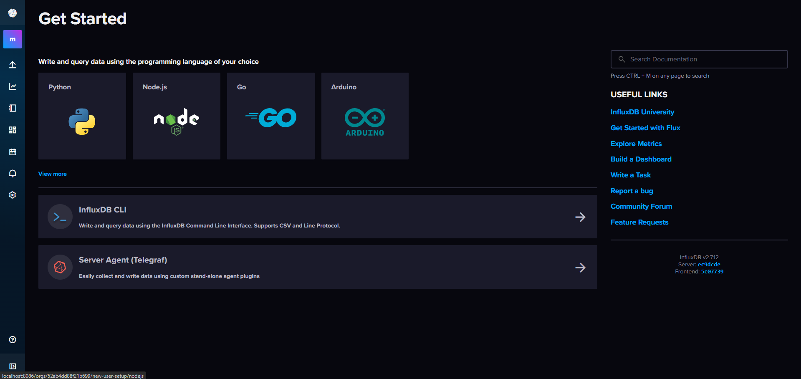
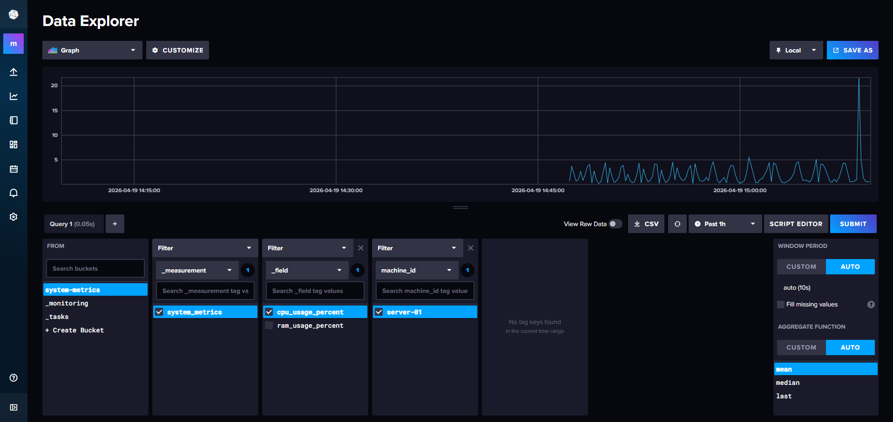
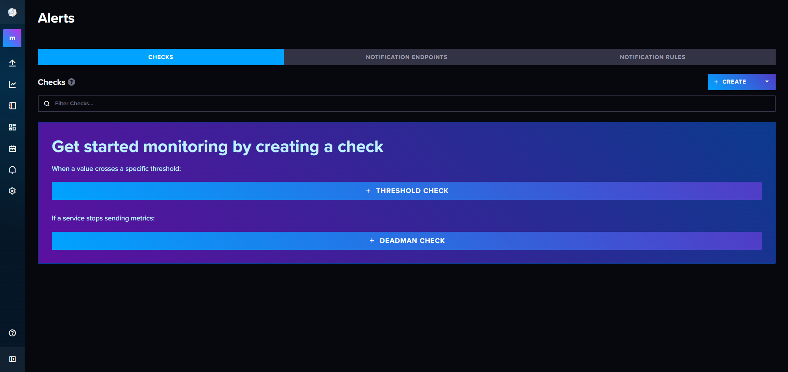
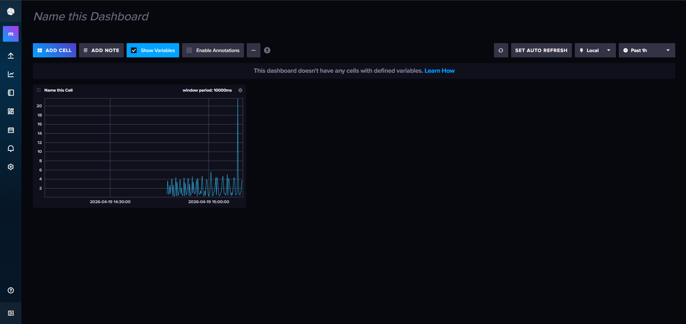

# 🚀 Real-Time System Monitoring with AI Predictions

A distributed real-time monitoring system that collects, processes, and visualizes system metrics using Kafka, Redis, InfluxDB, and Spring Boot.

---

## 🧠 Architecture

```
Python Sensor → Kafka → Spring Boot Backend → Redis (Cache)
                                       ↓
                                   InfluxDB → Dashboard
```

---

## ⚙️ Tech Stack

* **Backend:** Spring Boot (Java)
* **Streaming:** Apache Kafka
* **Cache:** Redis
* **Database:** InfluxDB (Time-Series DB)
* **Data Producer:** Python (System Metrics Sensor)
* **Containerization:** Docker & Docker Compose
* **Public Exposure:** ngrok

---

## 🚀 Features

* 📡 Real-time CPU & RAM monitoring
* ⚡ Kafka-based event streaming pipeline
* 🧠 Redis caching for fast data access
* 📊 Time-series data storage with InfluxDB
* 📈 Live dashboards with auto-refresh
* 🔄 Server-Sent Events (SSE) streaming
* 🌍 Public API exposure using ngrok

---

## 📸 Demo Screenshots

### 🔹 InfluxDB Dashboard (Live Metrics)



### 🔹 Data Explorer (CPU Usage)



### 🔹 Alerts System



### 🔹 Dashboard Visualization



---

## 🧪 API Endpoints

| Endpoint           | Description               |
| ------------------ | ------------------------- |
| `/api/stream`      | Real-time streaming (SSE) |
| `/api/metrics`     | Fetch system metrics      |
| `/actuator/health` | Health check              |

---

## 🚀 Getting Started

### 1️⃣ Clone Repository

```
git clone https://github.com/krithish-001/real-time-system-monitoring-ai.git
cd real-time-system-monitoring-ai
```

---

### 2️⃣ Run with Docker

```
docker compose up -d --build
```

---

### 3️⃣ Access Services

* Backend API → http://localhost:8080
* InfluxDB Dashboard → http://localhost:8086

---

## 🌍 Public Access (ngrok)

```
ngrok http 8080
```

Use the generated URL to access your backend publicly.

---

## 📊 How It Works

1. Python sensor collects system metrics (CPU, RAM)
2. Metrics are sent to Kafka topic
3. Spring Boot backend consumes Kafka events
4. Data is cached in Redis for quick access
5. Data is stored in InfluxDB (time-series DB)
6. Dashboard visualizes metrics in real-time

---

## 💡 Future Enhancements

* 🤖 AI-based anomaly detection (LSTM)
* 📧 Alert system (Email / Slack integration)
* 🌐 Frontend dashboard (React)
* ☸️ Kubernetes deployment
* 🔄 CI/CD pipeline (GitHub Actions)

---

## 👨‍💻 Author

**Krithish R**

---

## ⭐ Support

If you found this project useful, give it a ⭐ on GitHub!
